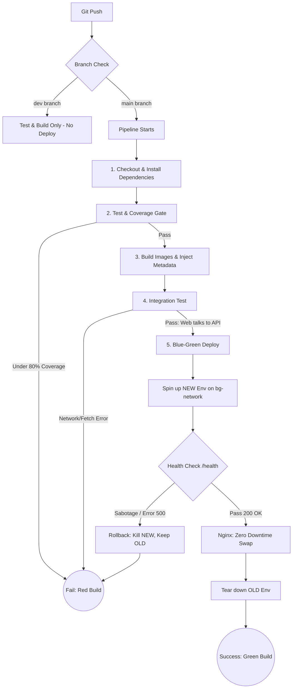

# Jenkins Blue-Green Pipeline

# 🛡️ מסמך ארכיטקטורה: Jenkins CI/CD & Blue-Green Deployment

מסמך זה מתאר את ארכיטקטורת קו הייצור האוטומטי (CI/CD Pipeline) של הפרויקט. המערכת תוכננה ועוצבה בסטנדרטים של סביבת Production, תוך מתן דגש על שרידות גבוהה, אפס זמן נפילה (Zero Downtime), מנגנוני Rollback אוטומטיים, והפרדת רשתות מאובטחת.

## 🛠️ טכנולוגיות מרכזיות (Tech Stack)

- **תשתיות ואוטומציה:** Jenkins, Docker, Docker Compose, Bash Scripting.
- **ניתוב תעבורה (Reverse Proxy):** Nginx.
- **צד שרת (Backend):** Node.js, Express.js.
- **בדיקות תוכנה:** Jest (Unit Tests & Coverage).

---

## 📐 זרימת הנתונים והתהליכים (Pipeline Flow)

